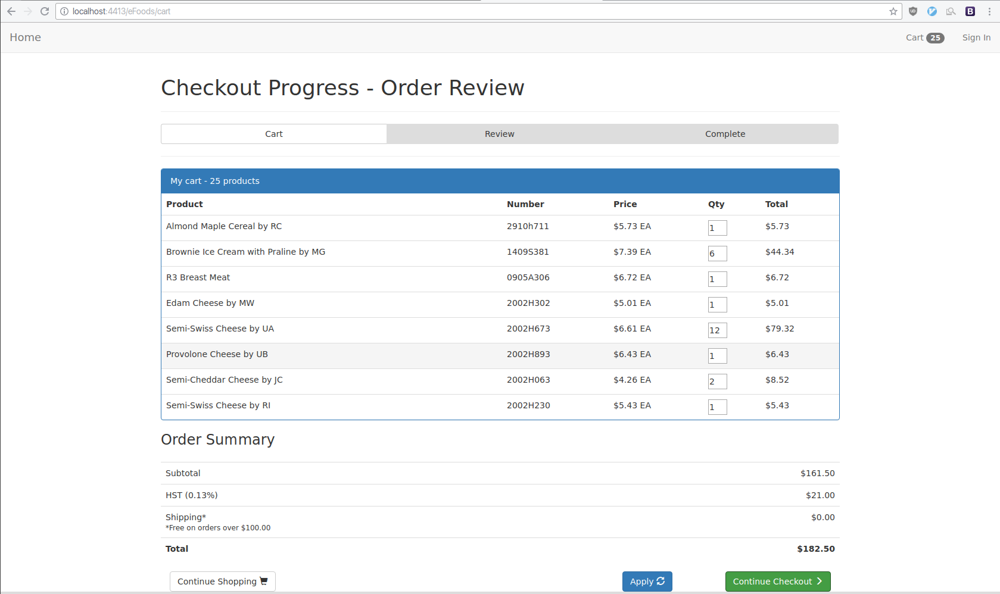

# eFoods
This is the final project for EECS 4413 (Building Ecommerce Systems) from Fall 2016 written in Java (with JEE) and vanilla javascript.

## Requirements

#### Core Website (B2C)

Essentially eFoods is a simple ecommerce website for food products. The site must display products on the homepage and seperate
category pages, provide functionality to search for a specific product, add to/delete from shopping cart, perform a checkout, and 
lastly, be able to view and revisit a purchase order summary form.

##### Some screenshots of the website itself:

#### Analytics / Ad-hoc functionality

For analytics the management wants to be able to determine the average time taken for a client to add an item to the cart
as well as the average time between a fresh visit and a checkout in one session. We must provide a way for these two
statistics to be viewed & updated in real time.

On an ad-hoc basis managementwants to adverties a certain item when a related item is added to the cart, as a proof of concept,
whenever the item number `1409S413` is added to the cart, cross-sell `2002H712`. This functionality should not be
part of the webapp since it may be disabled at any time without recompiling.

#### Authentication

Users of the website must be able to authenticate themselves by being redirected to a seperate server 
(in this case the York University computer science servers) where they are prompted to log in to their CSE account via
HTTP Basic. Once logged in, a perl script ([auth.cgi](auth/auth.cgi)) will generate a hash and redirect back to
the main application where we verify the hash and determine whether the authentication was successful. 

This type of authentication flow is supposed to be similiar to OAuth since we are delegating the authentication
to a seperate entity. Our authentication endpoint only exists to redirect to the other server and verify tokens sent from
the other server.
